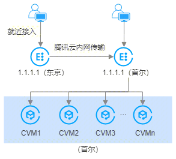

- [加速解决方案的总体思路](#加速解决方案的总体思路)
- [概念介绍](#概念介绍)
- [anycast公网加速](#anycast公网加速)
- [GAAP全球应用加速](#gaap全球应用加速)
- [静态CDN](#静态cdn)
- [全站加速](#全站加速)
- [负载均衡CLB](#负载均衡clb)
- [对比](#对比)

# 加速解决方案的总体思路
1. 尽可能把服务器放在离玩家物理距离近的地方
2. 把长距离公网传输改为稳定的内网传输

# 概念介绍
- GeoDNS
能够根据用户的地理位置，返回最优的接入IP，我们称之为GeoDNS。这种服务在腾讯内部叫gslb，在AWS叫Route 53，其他厂商也能提供类似服务。

# anycast公网加速

1. 使用 Anycast 的 EIP，该 IP 同时在多地 Anycast，实现多地同服。
用户后端集中维护一套集群，然后绑定 Anycast 类型的 EIP。该 EIP 借助腾讯云内网和 POP 点，多地发路由。
客户不用感知网络路径的选择，无需手动指定 IP 的发布位置，流量就近完成了全局负载均衡，从最优的地域进出，后端得到简化。同时，客户的 IP 得到收敛，无需每个地域配一个 IP 和 DNS 规则，在备案和管理上得到简化。
2. 传输质量得到提高。
多个 IP 发布地，实现了多路径，增加了网络的容错能力。此外，就近接入后走的是专线传输，比公网传输更可靠、更低延时，提升了玩家的体验。

# GAAP全球应用加速

跨区域访问业务，往往会因为区域之间的网络状况不同而导致延时和丢包率增加，影响跨域访问业务的用户体验，通过全球应用加速，在加速区域（用户所在区域）与源站区域（服务器所在区域）之间创建高速通道，可有效降低网络时延和丢包率，保障网络的快速和稳定性，提升用户体验。

# 静态CDN
CDN（Content Delivery Network）内容分发网络，将网站内容发布到最接近用户的边缘节点，使网民可就近取得所需内容，有效解决互联网网络拥塞状况，提高网民访问的响应速度和成功率。静态CDN服务以图片、页面、js、css、大文件安装包等静态文件加速为主。

# 全站加速

# 负载均衡CLB
负载均衡（Cloud Load Balancer）是对多台 [云服务器](https://cloud.tencent.com/doc/product/213/495) 进行流量分发的服务。负载均衡可以通过流量分发扩展应用系统对外的服务能力，通过消除单点故障提升应用系统的可用性。
负载均衡服务通过设置虚拟服务地址（VIP），将位于**同一地域**的多台云服务器资源虚拟成一个高性能、高可用的应用服务池。根据应用指定的方式，将来自客户端的网络请求分发到云服务器池中。
负载均衡服务会检查云服务器池中云服务器实例的健康状态，自动隔离异常状态的实例，从而解决了云服务器的单点问题，同时提高了应用的整体服务能力。
腾讯云提供的负载均衡服务具备自助管理、自助故障修复，防网络攻击等高级功能，适用于企业、社区、电子商务、游戏等多种用户场景。

# 对比
