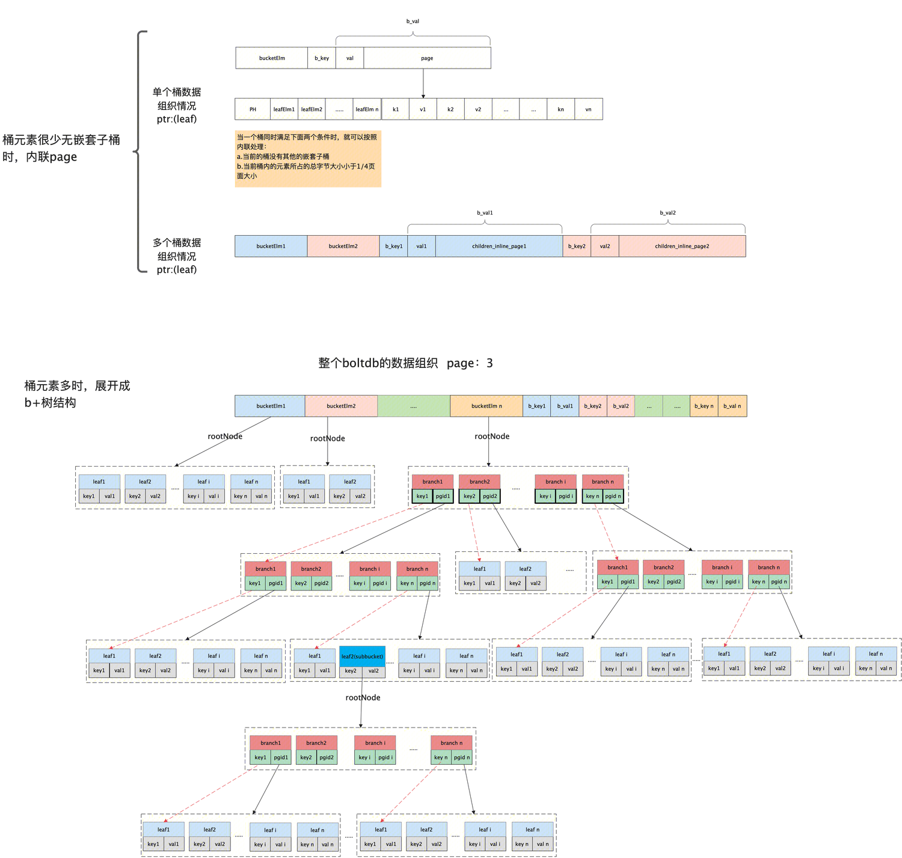
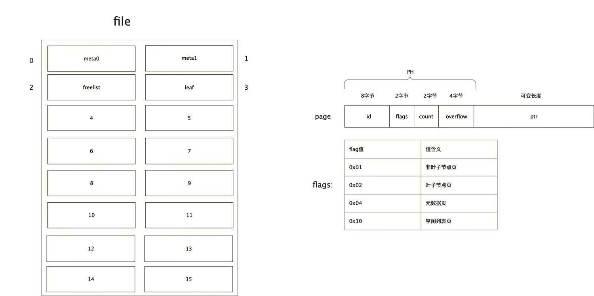
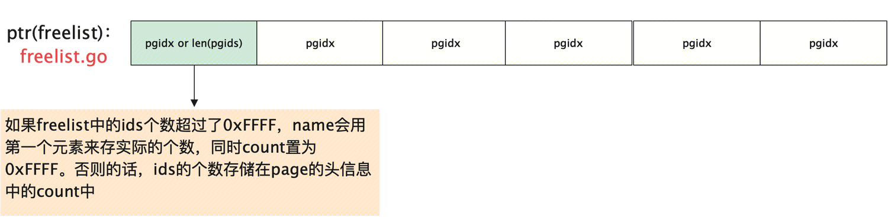
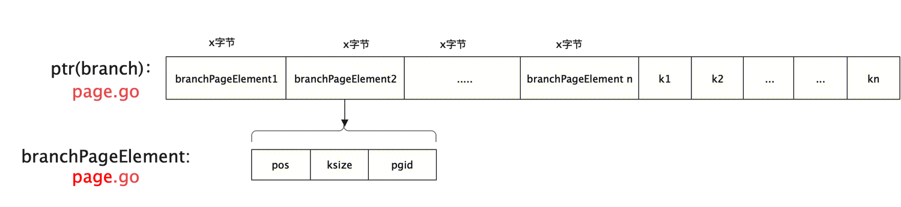
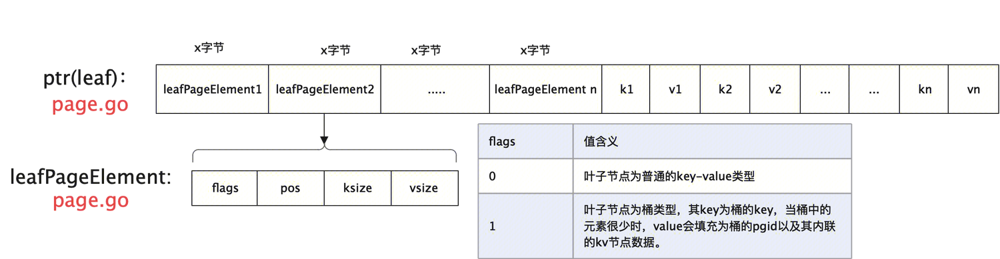
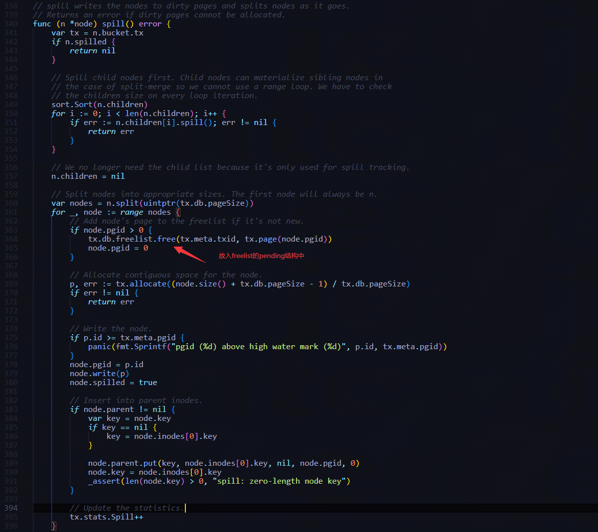

- [1. Bucket实现](#1-bucket实现)
  - [1.1 Bucket相关的数据结构](#11-bucket相关的数据结构)
- [2. Page实现](#2-page实现)
  - [2.1 Page数据结构](#21-page数据结构)
  - [2.2 元数据页page](#22-元数据页page)
  - [2.3 空闲列表页](#23-空闲列表页)
  - [2.4 分支节点页](#24-分支节点页)
  - [2.5 叶子节点页](#25-叶子节点页)
- [3. Cursor实现](#3-cursor实现)
  - [3.1 Cursor数据结构](#31-cursor数据结构)
- [4. node实现](#4-node实现)
  - [4.1 node相关的数组结构](#41-node相关的数组结构)
  - [4.2 节点的合并与分裂](#42-节点的合并与分裂)
- [5. 事务控制](#5-事务控制)
  - [5.1 事务相关数据结构](#51-事务相关数据结构)
  - [5.2 事务的初始化](#52-事务的初始化)
  - [5.3 只读事务](#53-只读事务)
  - [5.4 读写事务](#54-读写事务)
  - [5.5 读写事务的提交](#55-读写事务的提交)
  - [5.6 读写事务的回滚](#56-读写事务的回滚)
  - [5.7 批量事务](#57-批量事务)
  - [5.8 事务的ACID特性](#58-事务的acid特性)
- [6. 空闲page的管理](#6-空闲page的管理)
  - [6.1 空闲page的数据结构](#61-空闲page的数据结构)
  - [6.2 空闲页的释放](#62-空闲页的释放)
  - [6.3 空闲页的申请](#63-空闲页的申请)
- [7. db对象](#7-db对象)
  - [7.1 db对象的初始化](#71-db对象的初始化)
  - [7.2 读写事务的操作api接口](#72-读写事务的操作api接口)
- [8. 疑问](#8-疑问)
- [参考文档](#参考文档)

# 1. Bucket实现
## 1.1 Bucket相关的数据结构
```
// bucket represents the on-file representation of a bucket.
// This is stored as the "value" of a bucket key. If the bucket is small enough,
// then its root page can be stored inline in the "value", after the bucket
// header. In the case of inline buckets, the "root" will be 0.
type bucket struct {
    root     pgid   // page id of the bucket's root-level page。   根节点的pgid
    sequence uint64 // monotonically incrementing, used by NextSequence()
}

// Bucket represents a collection of key/value pairs inside the database.
type Bucket struct {
    *bucket
    tx       *Tx                // the associated transaction
    buckets  map[string]*Bucket // subbucket cache
    page     *page              // inline page reference, 当Bucket占用空间比较小时，Bucket的value就存储在这个字段中，此时root pgid就是0
    rootNode *node              // materialized node for the root page。 也就是root pgid的反序列化内容
    nodes    map[pgid]*node     // node cache

    // Sets the threshold for filling nodes when they split. By default,
    // the bucket will fill to 50% but it can be useful to increase this
    // amount if you know that your write workloads are mostly append-only.
    //
    // This is non-persisted across transactions so it must be set in every Tx.
    FillPercent float64
}
```
bucket中的存储方式如下所示：



- 子Bucket
子Bucket是存储在父Bucket的叶子节点中。
1. 当子Bucket占用空间比较小时，子Bucket的k-v键值对就放在父Bucket叶子节点里面，value就是就是bucket+rootNode序列化为内联page
```
var bucket = Bucket{
    bucket:      &bucket{},
    rootNode:    &node{isLeaf: true},
    FillPercent: DefaultFillPercent,
}
func (b *Bucket) write() []byte {
    // Allocate the appropriate size.
    var n = b.rootNode
    var value = make([]byte, bucketHeaderSize+n.size())

    // Write a bucket header.
    var bucket = (*bucket)(unsafe.Pointer(&amp;value[0]))
    *bucket = *b.bucket

    // Convert byte slice to a fake page and write the root node.
    var p = (*page)(unsafe.Pointer(&amp;value[bucketHeaderSize]))
    n.write(p)

    return value
}
```
2. 当子Bucket占用空间增长到一定程度时，子Bucket的rootNode就会采用新page存储，并且将新page的页id保存到Bucket的root字段中，root字段非0表示该Bucket不是内联Bucket。

# 2. Page实现
## 2.1 Page数据结构
```
type pgid uint64
type page struct {
    id       pgid  // 页id
    flags    uint16  // flags：页类型，可以是分支，叶子节点，元信息，空闲列表
    count    uint16  // 个数 2字节，统计叶子节点、非叶子节点、空闲列表页的个数
    overflow uint32  // 4字节，数据是否有溢出，主要在空闲列表上有用。表示后面还有多少个连续页被同一个txid申请，在事务释放的时候用于控制释放多少个页
}
```

## 2.2 元数据页page
```
type meta struct {
    magic    uint32  //魔数
    version  uint32  //版本
    pageSize uint32  //page页的大小，该值和操作系统默认的页大小保持一致
    flags    uint32  //保留值，目前貌似还没用到
    root     bucket  //所有小柜子bucket的根
    freelist pgid    //空闲列表页的id
    pgid     pgid    //表示db数据文件占用了多少页的内存空间
    txid     txid    //最大的事务id
    checksum uint64  //用作校验的校验和
}

// write writes the meta onto a page. 元数据页序列化到page
func (m *meta) write(p *page) {
    if m.root.root >= m.pgid {
        panic(fmt.Sprintf("root bucket pgid (%d) above high water mark (%d)", m.root.root, m.pgid))
    } else if m.freelist >= m.pgid &amp;&amp; m.freelist != pgidNoFreelist {
        // TODO: reject pgidNoFreeList if !NoFreelistSync
        panic(fmt.Sprintf("freelist pgid (%d) above high water mark (%d)", m.freelist, m.pgid))
    }

    // Page id is either going to be 0 or 1 which we can determine by the transaction ID. 序列化page header
    p.id = pgid(m.txid % 2)
    p.flags |= metaPageFlag

    // Calculate the checksum.
    m.checksum = m.sum64()

    m.copy(p.meta())  // 序列化page body
}
```
## 2.3 空闲列表页


## 2.4 分支节点页

在内存中，具体的一个分支节点或者叶子节点都被抽象为一个node对象，其中是分支节点还是叶子节点主要通通过其isLeaf字段来区分。下面对分支节点和叶子节点做两点说明：
1. 对叶子节点而言，其没有children这个信息。同时也没有key信息。isLeaf字段为true，其上存储的key、value都保存在inodes中
2. 对于分支节点而言，其具有key信息，同时children也不一定为空。isLeaf字段为false，同时该节点上的数据保存在inode中。

## 2.5 叶子节点页

```
// leafPageElement represents a node on a leaf page. 叶子节点既存储key，也存储value
type leafPageElement struct {
    flags uint32   //该值主要用来区分，是子桶叶子节点元素还是普通的key/value叶子节点元素。flags值为1时表示子桶。否则为key/value
    pos   uint32
    ksize uint32
    vsize uint32
}
```
子bucket也是叶子节点的一种。

# 3. Cursor实现
## 3.1 Cursor数据结构
```
type Cursor struct {
    bucket *Bucket
    stack  []elemRef
}
```
cursor游标的核心作用就是：从Bucket的根节点开始，采用二分搜索，一直找到第一个叶子节点，然后依次顺序遍历每个叶子节点的所有k-v键值对。当然也可以根据入参key直接找对对应的k-v键值对。
注意：如果遍历遇到叶子节点的子Bucket元素，则只返回子Bucket的key。

# 4. node实现
## 4.1 node相关的数组结构
```
// node represents an in-memory, deserialized page.
type node struct {
    bucket     *Bucket  // 该节点归属于哪个Bucket
    isLeaf     bool   // 表示是否为叶子节点
    unbalanced bool   // true表示该节点需要check下是否需要做合并操作
    spilled    bool
    key        []byte  // 表示inodes列表中最小的key
    pgid       pgid   // 该节点是从哪个page页反序列化而来的
    parent     *node  // 父节点
    children   nodes  // 已从page页加载到node的子节点列表
    inodes     inodes // 对于分支节点表示所有子节点信息；对于叶子节点则表示其包含的所有k-v键值对
}

// inode represents an internal node inside of a node.
// It can be used to point to elements in a page or point
// to an element which hasn't been added to a page yet.
type inode struct {
    flags uint32  // 表示是否是子桶叶子节点还是普通叶子节点。如果flags值为1表示子桶叶子节点，否则为普通叶子节点
    pgid  pgid    // 当inode为分支元素时，pgid才有值，为叶子元素时，则没值
    key   []byte
    value []byte  // 当inode为分支元素时，value为空，为叶子元素时，才有值
}

type inodes []inode
```
node其实就是B+树中的分支节点或者叶子节点，其内容是根据page反序列化而来。反序列化的代码如下：
```
// read initializes the node from a page.
func (n *node) read(p *page) {
    n.pgid = p.id
    n.isLeaf = ((p.flags &amp; leafPageFlag) != 0)
    n.inodes = make(inodes, int(p.count))

    for i := 0; i < int(p.count); i++ {
        inode := &amp;n.inodes[i]
        if n.isLeaf {
            elem := p.leafPageElement(uint16(i))
            inode.flags = elem.flags
            inode.key = elem.key()
            inode.value = elem.value()
        } else {
            elem := p.branchPageElement(uint16(i))
            inode.pgid = elem.pgid
            inode.key = elem.key()
        }
        _assert(len(inode.key) > 0, "read: zero-length inode key")
    }

    // Save first key so we can find the node in the parent when we spill.
    if len(n.inodes) > 0 {
        n.key = n.inodes[0].key
        _assert(len(n.key) > 0, "read: zero-length node key")
    } else {
        n.key = nil
    }
}
```
## 4.2 节点的合并与分裂
- 节点合并的条件：
节点占用内存大小 <= 1/4 页大小 或者 包含的inode数量 <= 2（对应叶子节点这个值时1）。合并时，对于根节点如果根节点是分支节点并且只有一个inode则直接将根节点的孙子节点提升为其子节点（原来的子节点可以释放掉）；对于非根节点（包括分支节点和叶子节点），如果包含的inode数量为0则直接让其父节点删除该节点，否则将该节点与其兄弟节点（优先找左边的兄弟，左边兄弟不存在则找右边的兄弟，父亲节点必然包含2个及其以上的子节点）进行合并，合并的逻辑是：将兄弟节点的inode列表收编到本节点名下，然后让其父节点删除其兄弟节点。

- 节点分裂的条件：
包含的inode数目 > 4 并且 node占用内存大小 >= page_size。分裂时的inode分割线是左边节点的inode数目大于>=2并且再往左边节点增加1个inode后其内存大小 > 0.5 * page_size，然后再对分裂后的右边节点再次执行分裂逻辑。


# 5. 事务控制
在boltdb中支持两类事务：**读写事务**、**只读事务**。同一时间有且只能有一个读写事务执行；但同一个时间可以允许有多个只读事务执行。每个事务都拥有自己的一套一致性视图。

## 5.1 事务相关数据结构
```
// Tx represents a read-only or read/write transaction on the database.
// Read-only transactions can be used for retrieving values for keys and creating cursors.
// Read/write transactions can create and remove buckets and create and remove keys.
//
// IMPORTANT: You must commit or rollback transactions when you are done with
// them. Pages can not be reclaimed by the writer until no more transactions
// are using them. A long running read transaction can cause the database to
// quickly grow.
type Tx struct {
    writable       bool
    managed        bool
    db             *DB
    meta           *meta
    root           Bucket
    pages          map[pgid]*page
    stats          TxStats
    commitHandlers []func()

    // WriteFlag specifies the flag for write-related methods like WriteTo().
    // Tx opens the database file with the specified flag to copy the data.
    //
    // By default, the flag is unset, which works well for mostly in-memory
    // workloads. For databases that are much larger than available RAM,
    // set the flag to syscall.O_DIRECT to avoid trashing the page cache.
    WriteFlag int
}
```
## 5.2 事务的初始化
```
func (tx *Tx) init(db *DB) {
    tx.db = db
    tx.pages = nil

    // Copy the meta page since it can be changed by the writer.
    tx.meta = &meta{}
    db.meta().copy(tx.meta)   // db.meta()获取到的是事务id较大的那个meta

    // Copy over the root bucket.
    tx.root = newBucket(tx)
    tx.root.bucket = &bucket{}
    *tx.root.bucket = tx.meta.root   // 给事务新创建一个Bucket，该Bucket的根节点赋值为db文件的根节点

    // Increment the transaction id and add a page cache for writable transactions.
    if tx.writable {
        tx.pages = make(map[pgid]*page)  // 事务新写入的脏页缓存，事务采用COW技术，没有修改的page是不会添加到这个缓存的。
        tx.meta.txid += txid(1)    // 事务ID赋值为meta页保存的事务ID + 1
    }
}
```
## 5.3 只读事务
```
func (db *DB) beginTx() (*Tx, error) {
    // Lock the meta pages while we initialize the transaction. We obtain
    // the meta lock before the mmap lock because that's the order that the
    // write transaction will obtain them.
    db.metalock.Lock()

    // Obtain a read-only lock on the mmap. When the mmap is remapped it will
    // obtain a write lock so all transactions must finish before it can be
    // remapped.
    db.mmaplock.RLock()

    // Exit if the database is not open yet.
    if !db.opened {
        db.mmaplock.RUnlock()
        db.metalock.Unlock()
        return nil, ErrDatabaseNotOpen
    }

    // Create a transaction associated with the database.
    t := &Tx{}
    t.init(db)

    // Keep track of transaction until it closes.
    db.txs = append(db.txs, t)  // db.txs中存储着正在运行的只读事务
    n := len(db.txs)

    // Unlock the meta pages.
    db.metalock.Unlock()

    // Update the transaction stats.
    db.statlock.Lock()
    db.stats.TxN++
    db.stats.OpenTxN = n
    db.statlock.Unlock()

    return t, nil
}
```
## 5.4 读写事务
```
func (db *DB) beginRWTx() (*Tx, error) {
    // If the database was opened with Options.ReadOnly, return an error.
    if db.readOnly {
        return nil, ErrDatabaseReadOnly
    }

    // Obtain writer lock. This is released by the transaction when it closes.
    // This enforces only one writer transaction at a time.
    db.rwlock.Lock()

    // Once we have the writer lock then we can lock the meta pages so that
    // we can set up the transaction.
    db.metalock.Lock()
    defer db.metalock.Unlock()

    // Exit if the database is not open yet.
    if !db.opened {
        db.rwlock.Unlock()
        return nil, ErrDatabaseNotOpen
    }

    // Create a transaction associated with the database.
    t := &Tx{writable: true}
    t.init(db)
    db.rwtx = t
    db.freePages()
    return t, nil
}
```
## 5.5 读写事务的提交
```
// Commit writes all changes to disk and updates the meta page.
// Returns an error if a disk write error occurs, or if Commit is
// called on a read-only transaction.
func (tx *Tx) Commit() error {
    _assert(!tx.managed, "managed tx commit not allowed")
    if tx.db == nil {
        return ErrTxClosed
    } else if !tx.writable {
        return ErrTxNotWritable
    }

    // TODO(benbjohnson): Use vectorized I/O to write out dirty pages.

    // Rebalance nodes which have had deletions.
    var startTime = time.Now()
    tx.root.rebalance()
    if tx.stats.Rebalance > 0 {
        tx.stats.RebalanceTime += time.Since(startTime)
    }

    // spill data onto dirty pages.
    startTime = time.Now()
    if err := tx.root.spill(); err != nil {
        tx.rollback()
        return err
    }
    tx.stats.SpillTime += time.Since(startTime)

    // Free the old root bucket.
    tx.meta.root.root = tx.root.root   // 经过节点的合并与分裂处理后，meta页重新指向新的根节点，根节点一定会变化

    // Free the old freelist because commit writes out a fresh freelist.  释放freelist占用的page，因为commitFreelist会将freelist刷到新page然后meta页指向新的page
    if tx.meta.freelist != pgidNoFreelist {
        tx.db.freelist.free(tx.meta.txid, tx.db.page(tx.meta.freelist))
    }

    if !tx.db.NoFreelistSync {
        err := tx.commitFreelist()
        if err != nil {
            return err
        }
    } else {
        tx.meta.freelist = pgidNoFreelist
    }

    // Write dirty pages to disk.  将所有修改的page刷到磁盘上
    startTime = time.Now()
    if err := tx.write(); err != nil {
        tx.rollback()
        return err
    }

    // If strict mode is enabled then perform a consistency check.
    // Only the first consistency error is reported in the panic.
    if tx.db.StrictMode {
        ch := tx.Check()
        var errs []string
        for {
            err, ok := <-ch
            if !ok {
                break
            }
            errs = append(errs, err.Error())
        }
        if len(errs) > 0 {
            panic("check fail: " + strings.Join(errs, "\n"))
        }
    }

    // Write meta to disk.
    if err := tx.writeMeta(); err != nil {
        tx.rollback()
        return err
    }
    tx.stats.WriteTime += time.Since(startTime)

    // Finalize the transaction.
    tx.close()

    // Execute commit handlers now that the locks have been removed.
    for _, fn := range tx.commitHandlers {
        fn()
    }

    return nil
}

// write writes any dirty pages to disk.
func (tx *Tx) write() error {
    // Sort pages by id.
    pages := make(pages, 0, len(tx.pages))
    for _, p := range tx.pages {
        pages = append(pages, p)
    }
    // Clear out page cache early.
    tx.pages = make(map[pgid]*page)
    sort.Sort(pages)

    // Write pages to disk in order.
    for _, p := range pages {
        size := (int(p.overflow) + 1) * tx.db.pageSize
        offset := int64(p.id) * int64(tx.db.pageSize)

        // Write out page in "max allocation" sized chunks.
        ptr := uintptr(unsafe.Pointer(p))
        for {
            // Limit our write to our max allocation size.
            sz := size
            if sz > maxAllocSize-1 {
                sz = maxAllocSize - 1
            }

            // Write chunk to disk.
            buf := *(*[]byte)(unsafe.Pointer(&amp;reflect.SliceHeader{
                Data: ptr,
                Len:  sz,
                Cap:  sz,
            }))
            if _, err := tx.db.ops.writeAt(buf, offset); err != nil {
                return err
            }

            // Update statistics.
            tx.stats.Write++

            // Exit inner for loop if we've written all the chunks.
            size -= sz
            if size == 0 {
                break
            }

            // Otherwise move offset forward and move pointer to next chunk.
            offset += int64(sz)
            ptr += uintptr(sz)
        }
    }

    // Ignore file sync if flag is set on DB.
    if !tx.db.NoSync || IgnoreNoSync {
        if err := fdatasync(tx.db); err != nil {
            return err
        }
    }

    // Put small pages back to page pool.
    for _, p := range pages {
        // Ignore page sizes over 1 page.
        // These are allocated using make() instead of the page pool.
        if int(p.overflow) != 0 {
            continue
        }

        buf := *(*[]byte)(unsafe.Pointer(&amp;reflect.SliceHeader{
            Data: uintptr(unsafe.Pointer(p)),
            Len:  tx.db.pageSize,
            Cap:  tx.db.pageSize,
        }))

        // See https://go.googlesource.com/go/+/f03c9202c43e0abb130669852082117ca50aa9b1
        for i := range buf {
            buf[i] = 0
        }
        tx.db.pagePool.Put(buf)
    }

    return nil
}
```

## 5.6 读写事务的回滚
回滚逻辑比较简单，其实只要没有将事务的dirty page回刷到磁盘，也就自动回滚了。
```
// Rollback closes the transaction and ignores all previous updates. Read-only
// transactions must be rolled back and not committed.
func (tx *Tx) Rollback() error {
    _assert(!tx.managed, "managed tx rollback not allowed")
    if tx.db == nil {
        return ErrTxClosed
    }
    tx.nonPhysicalRollback()
    return nil
}

// nonPhysicalRollback is called when user calls Rollback directly, in this case we do not need to reload the free pages from disk.
func (tx *Tx) nonPhysicalRollback() {
    if tx.db == nil {
        return
    }
    if tx.writable {
        tx.db.freelist.rollback(tx.meta.txid)
    }
    tx.close()
}

func (tx *Tx) close() {
    if tx.db == nil {
        return
    }
    if tx.writable {
        // Grab freelist stats.
        var freelistFreeN = tx.db.freelist.free_count()
        var freelistPendingN = tx.db.freelist.pending_count()
        var freelistAlloc = tx.db.freelist.size()

        // Remove transaction ref &amp; writer lock.
        tx.db.rwtx = nil
        tx.db.rwlock.Unlock()

        // Merge statistics.
        tx.db.statlock.Lock()
        tx.db.stats.FreePageN = freelistFreeN
        tx.db.stats.PendingPageN = freelistPendingN
        tx.db.stats.FreeAlloc = (freelistFreeN + freelistPendingN) * tx.db.pageSize
        tx.db.stats.FreelistInuse = freelistAlloc
        tx.db.stats.TxStats.add(&amp;tx.stats)
        tx.db.statlock.Unlock()
    } else {
        tx.db.removeTx(tx)
    }

    // Clear all references.
    tx.db = nil
    tx.meta = nil
    tx.root = Bucket{tx: tx}
    tx.pages = nil
}
```

## 5.7 批量事务
可以将多个写操作，用一个读写事务搞定。目前etcd没有用这个
```
func (db *DB) Batch(fn func(*Tx) error) error {
    errCh := make(chan error, 1)

    db.batchMu.Lock()
    if (db.batch == nil) || (db.batch != nil &amp;&amp; len(db.batch.calls) >= db.MaxBatchSize) {
        // There is no existing batch, or the existing batch is full; start a new one.
        db.batch = &amp;batch{
            db: db,
        }
        db.batch.timer = time.AfterFunc(db.MaxBatchDelay, db.batch.trigger)
    }
    db.batch.calls = append(db.batch.calls, call{fn: fn, err: errCh})
    if len(db.batch.calls) >= db.MaxBatchSize {
        // wake up batch, it's ready to run
        go db.batch.trigger()
    }
    db.batchMu.Unlock()

    err := <-errCh
    if err == trySolo {
        err = db.Update(fn)
    }
    return err
}

type call struct {
    fn  func(*Tx) error
    err chan<- error
}

type batch struct {
    db    *DB
    timer *time.Timer
    start sync.Once
    calls []call
}

// trigger runs the batch if it hasn't already been run.
func (b *batch) trigger() {
    b.start.Do(b.run)
}

// run performs the transactions in the batch and communicates results
// back to DB.Batch.
func (b *batch) run() {
    b.db.batchMu.Lock()
    b.timer.Stop()
    // Make sure no new work is added to this batch, but don't break
    // other batches.
    if b.db.batch == b {
        b.db.batch = nil
    }
    b.db.batchMu.Unlock()

retry:
    for len(b.calls) > 0 {
        var failIdx = -1
        err := b.db.Update(func(tx *Tx) error {
            for i, c := range b.calls {
                if err := safelyCall(c.fn, tx); err != nil {
                    failIdx = i
                    return err
                }
            }
            return nil
        })

        if failIdx >= 0 {
            // take the failing transaction out of the batch. it's
            // safe to shorten b.calls here because db.batch no longer
            // points to us, and we hold the mutex anyway.
            c := b.calls[failIdx]
            b.calls[failIdx], b.calls = b.calls[len(b.calls)-1], b.calls[:len(b.calls)-1]
            // tell the submitter re-run it solo, continue with the rest of the batch
            c.err <- trySolo
            continue retry
        }

        // pass success, or bolt internal errors, to all callers
        for _, c := range b.calls {
            c.err <- err
        }
        break retry
    }
}
```
## 5.8 事务的ACID特性
- 原子性（atomicity)
修改事务在事务开始时拷贝metadata，
所有的修改操作都在内存中完成，不会影响到数据库文件。
落盘时先写b+数据和freelist数据，最后写metadata的顺序执行。只有metadata写入成功，才算成功，如果任何一步写入失败，直接丢掉freelist中该事务分配的pageid，重新载入freelist即可。

- 一致性（consistency)
写事务只有在metadata成功写入才算事务成功执行。即使故障或断电，也不会影响数据库的一致。

- 隔离性（isolation）
写事务串行执行，读事务可并发执行。使用MVCC多版本并发控制。每个事务都会分配一个事务版本号txid。
读事务txid = db.meta.txid，写事务txid = db.meta.txid + 1
读事务的生命周期中，不会受到写事务影响：

>1.写操作在持久化前都在内存中进行
 2.持久化后，修改后的数据会分配额外的pageid，不会影响以前的page，修改过的page均处于pending状态，版本号低的txid是无法访问到的
 3.在每次读事务开始时，都会获取最新的db.meta.txid，写事务开始时，会把小于最小txid的处于pending状态的给放入空闲id列表，保证了新开始的读事务能读到较新的版本。

- 持久性（durability）
boltdb 使用了两个metadata来保证故障或重启时进行恢复。metadata选取时有校验机制，使用一个metadata来恢复另一个metadata时，只需要恢复freelist。

# 6. 空闲page的管理
注意db文件初始化的时候，freelist中是不会存在任何空闲页面的。
## 6.1 空闲page的数据结构
```
// txPending holds a list of pgids and corresponding allocation txns
// that are pending to be freed.
type txPending struct {
    ids              []pgid       // 表示该事务待释放的所有page_id
    alloctx          []txid // txids allocating the ids   // 依次表示ids中所有page_id对应的事务id，也就是某个事务可能引用了其他事务申请的page
    lastReleaseBegin txid   // beginning txid of last matching releaseRange
}

// freelist represents a list of all pages that are available for allocation.
// It also tracks pages that have been freed but are still in use by open transactions.
type freelist struct {
    freelistType   FreelistType                // freelist type
    ids            []pgid                      // all free and available free page ids.  所有的空闲page_id列表
    allocs         map[pgid]txid               // mapping of txid that allocated a pgid.  page ---> 申请事务id的映射关系， 只会记录所申请连续空间的首页
    pending        map[txid]*txPending         // mapping of soon-to-be free page ids by tx.
    cache          map[pgid]bool               // fast lookup of all free and pending page ids.   用来判断某页是否空闲page的缓存，可以快速判断
    freemaps       map[uint64]pidSet           // key is the size of continuous pages(span), value is a set which contains the starting pgids of same size
    forwardMap     map[pgid]uint64             // key is start pgid, value is its span size
    backwardMap    map[pgid]uint64             // key is end pgid, value is its span size
    allocate       func(txid txid, n int) pgid // the freelist allocate func
    free_count     func() int                  // the function which gives you free page number
    mergeSpans     func(ids pgids)             // the mergeSpan func
    getFreePageIDs func() []pgid               // get free pgids func
    readIDs        func(pgids []pgid)          // readIDs func reads list of pages and init the freelist
}
```

## 6.2 空闲页的释放
```
// freePages releases any pages associated with closed read-only transactions.  
func (db *DB) freePages() {
    // Free all pending pages prior to earliest open transaction. 释放当前最小只读事务之前的page
    sort.Sort(txsById(db.txs))
    minid := txid(0xFFFFFFFFFFFFFFFF)
    if len(db.txs) > 0 {
        minid = db.txs[0].meta.txid
    }
    if minid > 0 {
        db.freelist.release(minid - 1)
    }
    // Release unused txid extents.
    for _, t := range db.txs {
        db.freelist.releaseRange(minid, t.meta.txid-1)
        minid = t.meta.txid + 1
    }
    db.freelist.releaseRange(minid, txid(0xFFFFFFFFFFFFFFFF))
    // Any page both allocated and freed in an extent is safe to release.
}

// free releases a page and its overflow for a given transaction id.
// If the page is already free then a panic will occur.  这个函数只是将page放到待释放pending列表中
func (f *freelist) free(txid txid, p *page) {
    if p.id <= 1 {
        panic(fmt.Sprintf("cannot free page 0 or 1: %d", p.id))
    }

    // Free page and all its overflow pages.
    txp := f.pending[txid]
    if txp == nil {
        txp = &amp;txPending{}
        f.pending[txid] = txp
    }
    allocTxid, ok := f.allocs[p.id]
    if ok {
        delete(f.allocs, p.id)
    } else if (p.flags &amp; freelistPageFlag) != 0 {
        // Freelist is always allocated by prior tx.
        allocTxid = txid - 1
    }

    for id := p.id; id <= p.id+pgid(p.overflow); id++ {
        // Verify that page is not already free.
        if f.cache[id] {
            panic(fmt.Sprintf("page %d already freed", id))
        }
        // Add to the freelist and cache.
        txp.ids = append(txp.ids, id)
        txp.alloctx = append(txp.alloctx, allocTxid)  // 注意这里的allocTxid与txid不相同
        f.cache[id] = true
    }
}

// release moves all page ids for a transaction id (or older) to the freelist.  这个函数是将pending中待释放的page_id真正放到freelist中
func (f *freelist) release(txid txid) {
    m := make(pgids, 0)
    for tid, txp := range f.pending {
        if tid <= txid {
            // Move transaction's pending pages to the available freelist.
            // Don't remove from the cache since the page is still free.
            m = append(m, txp.ids...)
            delete(f.pending, tid)
        }
    }
    f.mergeSpans(m)
}

// releaseRange moves pending pages allocated within an extent [begin,end] to the free list.  
func (f *freelist) releaseRange(begin, end txid) {
    if begin > end {
        return
    }
    var m pgids
    for tid, txp := range f.pending {
        if tid < begin || tid > end {
            continue
        }
        // Don't recompute freed pages if ranges haven't updated.
        if txp.lastReleaseBegin == begin {
            continue
        }
        for i := 0; i < len(txp.ids); i++ {
            if atx := txp.alloctx[i]; atx < begin || atx > end {
                continue
            }
            m = append(m, txp.ids[i])
            txp.ids[i] = txp.ids[len(txp.ids)-1]
            txp.ids = txp.ids[:len(txp.ids)-1]
            txp.alloctx[i] = txp.alloctx[len(txp.alloctx)-1]
            txp.alloctx = txp.alloctx[:len(txp.alloctx)-1]
            i--
        }
        txp.lastReleaseBegin = begin
        if len(txp.ids) == 0 {
            delete(f.pending, tid)
        }
    }
    f.mergeSpans(m)
}
```
## 6.3 空闲页的申请
先申请一块连续内存[]byte，然后申请一个page_id，如果没有空闲的page_id，则mmap扩容下db文件，然后将之前的db.rwtx.meta.pgid作为这块内存的page_id。
```
// allocate returns a contiguous block of memory starting at a given page.
func (db *DB) allocate(txid txid, count int) (*page, error) {
    // Allocate a temporary buffer for the page.
    var buf []byte
    if count == 1 {
        buf = db.pagePool.Get().([]byte)
    } else {
        buf = make([]byte, count*db.pageSize)
    }
    p := (*page)(unsafe.Pointer(&amp;buf[0]))
    p.overflow = uint32(count - 1)

    // Use pages from the freelist if they are available.
    if p.id = db.freelist.allocate(txid, count); p.id != 0 {
        return p, nil
    }

    // Resize mmap() if we're at the end.
    p.id = db.rwtx.meta.pgid   // 当前db文件占用的page总页数
    var minsz = int((p.id+pgid(count))+1) * db.pageSize
    if minsz >= db.datasz {
        if err := db.mmap(minsz); err != nil {
            return nil, fmt.Errorf("mmap allocate error: %s", err)
        }
    }

    // Move the page id high water mark.
    db.rwtx.meta.pgid += pgid(count)

    return p, nil
}

// arrayAllocate returns the starting page id of a contiguous list of pages of a given size.
// If a contiguous block cannot be found then 0 is returned.
func (f *freelist) arrayAllocate(txid txid, n int) pgid {
    if len(f.ids) == 0 {
        return 0
    }

    var initial, previd pgid
    for i, id := range f.ids {
        if id <= 1 {
            panic(fmt.Sprintf("invalid page allocation: %d", id))
        }

        // Reset initial page if this is not contiguous.
        if previd == 0 || id-previd != 1 {
            initial = id
        }

        // If we found a contiguous block then remove it and return it.
        if (id-initial)+1 == pgid(n) {
            // If we're allocating off the beginning then take the fast path
            // and just adjust the existing slice. This will use extra memory
            // temporarily but the append() in free() will realloc the slice
            // as is necessary.
            if (i + 1) == n {
                f.ids = f.ids[i+1:]
            } else {
                copy(f.ids[i-n+1:], f.ids[i+1:])
                f.ids = f.ids[:len(f.ids)-n]
            }

            // Remove from the free cache.
            for i := pgid(0); i < pgid(n); i++ {
                delete(f.cache, initial+i)
            }
            f.allocs[initial] = txid
            return initial
        }

        previd = id
    }
    return 0
}
```
# 7. db对象
bolt db最大支持存储256T的数据量。
```
// maxMapSize represents the largest mmap size supported by Bolt.
const maxMapSize = 0xFFFFFFFFFFFF // 256TB
```

## 7.1 db对象的初始化
```
// init creates a new database file and initializes its meta pages.
func (db *DB) init() error {
    // Create two meta pages on a buffer.
    buf := make([]byte, db.pageSize*4)
    for i := 0; i < 2; i++ {
        p := db.pageInBuffer(buf[:], pgid(i))
        p.id = pgid(i)
        p.flags = metaPageFlag

        // Initialize the meta page.
        m := p.meta()
        m.magic = magic
        m.version = version
        m.pageSize = uint32(db.pageSize)
        m.freelist = 2
        m.root = bucket{root: 3}
        m.pgid = 4
        m.txid = txid(i)
        m.checksum = m.sum64()
    }

    // Write an empty freelist at page 3.
    p := db.pageInBuffer(buf[:], pgid(2))
    p.id = pgid(2)
    p.flags = freelistPageFlag
    p.count = 0   // 初始化时没有空闲页

    // Write an empty leaf page at page 4.
    p = db.pageInBuffer(buf[:], pgid(3))
    p.id = pgid(3)
    p.flags = leafPageFlag   // 初始化时根节点是叶子节点，并且没有inode列表
    p.count = 0

    // Write the buffer to our data file.
    if _, err := db.ops.writeAt(buf, 0); err != nil {
        return err
    }
    if err := fdatasync(db); err != nil {
        return err
    }

    return nil
}
```

## 7.2 读写事务的操作api接口
```
func (db *DB) Update(fn func(*Tx) error) error {
    t, err := db.Begin(true)
    if err != nil {
        return err
    }

    // Make sure the transaction rolls back in the event of a panic.
    defer func() {
        if t.db != nil {
            t.rollback()
        }
    }()

    // Mark as a managed tx so that the inner function cannot manually commit.
    t.managed = true

    // If an error is returned from the function then rollback and return error.
    err = fn(t)
    t.managed = false
    if err != nil {
        _ = t.Rollback()
        return err
    }

    return t.Commit()
}
```

# 8. 疑问
1. 搞两个meta page的目的是什么？
答：初始化时，两个meta page的txid分别是0，1。后续将meta page 刷到磁盘的时候，读写事务根据txid（这个txid只会在开启读写事务才会递增，只读事务不会递增txid）依次刷到第0页、第1页。两个meta页可以起到备份一个正确版本数据库的作用，比如如下：

当meta 1被写坏的时候，那下一个写事务会拿到meta 0（虽然meta 1的txid较大，但meta 1被损坏了），此时写事务的txid在meta 0的基础上加1，也就是101，写事务提交的时候，该事务会覆盖回刷那个被写坏的meta 1页。这样即使每次写入都把meta 页刷坏，也只能刷坏一个meta 页，从而保证一定有一个正确的meta页。
```
// meta retrieves the current meta page reference.
func (db *DB) meta() *meta {
    // We have to return the meta with the highest txid which doesn't fail
    // validation. Otherwise, we can cause errors when in fact the database is
    // in a consistent state. metaA is the one with the higher txid.
    metaA := db.meta0
    metaB := db.meta1
    if db.meta1.txid > db.meta0.txid {
        metaA = db.meta1
        metaB = db.meta0
    }

    // Use higher meta page if valid. Otherwise fallback to previous, if valid.
    if err := metaA.validate(); err == nil {
        return metaA
    } else if err := metaB.validate(); err == nil {
        return metaB
    }

    // This should never be reached, because both meta1 and meta0 were validated
    // on mmap() and we do fsync() on every write.
    panic("bolt.DB.meta(): invalid meta pages")
}
// init initializes the transaction.
func (tx *Tx) init(db *DB) {
    tx.db = db
    tx.pages = nil

    // Copy the meta page since it can be changed by the writer.
    tx.meta = &meta{}
    db.meta().copy(tx.meta)

    // Copy over the root bucket.
    tx.root = newBucket(tx)
    tx.root.bucket = &amp;bucket{}
    *tx.root.bucket = tx.meta.root

    // Increment the transaction id and add a page cache for writable transactions.
    if tx.writable {
        tx.pages = make(map[pgid]*page)
        tx.meta.txid += txid(1)
    }
}
// write writes the meta onto a page.
func (m *meta) write(p *page) {
    if m.root.root >= m.pgid {
        panic(fmt.Sprintf("root bucket pgid (%d) above high water mark (%d)", m.root.root, m.pgid))
    } else if m.freelist >= m.pgid &amp;&amp; m.freelist != pgidNoFreelist {
        // TODO: reject pgidNoFreeList if !NoFreelistSync
        panic(fmt.Sprintf("freelist pgid (%d) above high water mark (%d)", m.freelist, m.pgid))
    }

    // Page id is either going to be 0 or 1 which we can determine by the transaction ID.
    p.id = pgid(m.txid % 2)
    p.flags |= metaPageFlag

    // Calculate the checksum.
    m.checksum = m.sum64()

    m.copy(p.meta())
}
```
2. B+树是不是没保证树高度的平衡？
答：B+树的分裂机制：每次树高度要加1的时候，都是新增一个根节点，老根节点会成新根节点的子节点。这种机制天然保证了每个叶子节点必然在同一层。
3. freelist中的第一个空闲page从何而来？
答：修改数据时，新数据是写入新申请的page，而老数据占用的page则放入freelist的pending结构中。

4. 读写事务，老数据占用的page为什么不能立马释放，而是先放到pending中？
答：txid为7的读写事务完成后，可能还有txid为6和7的只读事务尚在进行中，这些只读事务还在读取老数据占用的page，如果txid为7的读写事务立马把这些老page释放，那么接下来txid为8的读写事务可能申请到这些page，然后写入新数据，导致txid为6和7的只读事务读取到未来数据。
5. 老数据占用的page真正释放的时机是什么？
答：释放时机是开启新的读写事务时，至于释放哪些page，则通过例子来说明。比如当前只读事务分别存在txid为5、15、25这三个，则5之前的读写事务所pending的老数据page则可以真正释放，因为5、15、25这些只读事务肯定不读1、2、3、4这些读写事务释放的老数据。另外 [6, 14]、[16, 24]、[26, 0xFFFFFFFFFFFFFFFF]这些闭区间内的读写事务所!!#ff0000 亲自申请!!的数据page也可以真正释放。

```
func (db *DB) beginRWTx() (*Tx, error) {
    // If the database was opened with Options.ReadOnly, return an error.
    if db.readOnly {
        return nil, ErrDatabaseReadOnly
    }

    // Obtain writer lock. This is released by the transaction when it closes.
    // This enforces only one writer transaction at a time.
    db.rwlock.Lock()

    // Once we have the writer lock then we can lock the meta pages so that
    // we can set up the transaction.
    db.metalock.Lock()
    defer db.metalock.Unlock()

    // Exit if the database is not open yet.
    if !db.opened {
        db.rwlock.Unlock()
        return nil, ErrDatabaseNotOpen
    }

    // Create a transaction associated with the database.
    t := &Tx{writable: true}
    t.init(db)
    db.rwtx = t
    db.freePages()
    return t, nil
}
// freePages releases any pages associated with closed read-only transactions.
func (db *DB) freePages() {
    // Free all pending pages prior to earliest open transaction.
    sort.Sort(txsById(db.txs))
    minid := txid(0xFFFFFFFFFFFFFFFF)
    if len(db.txs) > 0 {
        minid = db.txs[0].meta.txid
    }
    if minid > 0 {
        db.freelist.release(minid - 1)
    }
    // Release unused txid extents.
    for _, t := range db.txs {
        db.freelist.releaseRange(minid, t.meta.txid-1)
        minid = t.meta.txid + 1
    }
    db.freelist.releaseRange(minid, txid(0xFFFFFFFFFFFFFFFF))
    // Any page both allocated and freed in an extent is safe to release.
}
```

# 参考文档
[自底向上分析 BoltDB 源码](https://www.bookstack.cn/books/jaydenwen123-boltdb_book)
[boltdb源码阅读](https://mp.weixin.qq.com/s/QfcHJ7dazjRUSC3vCMuofQ)
